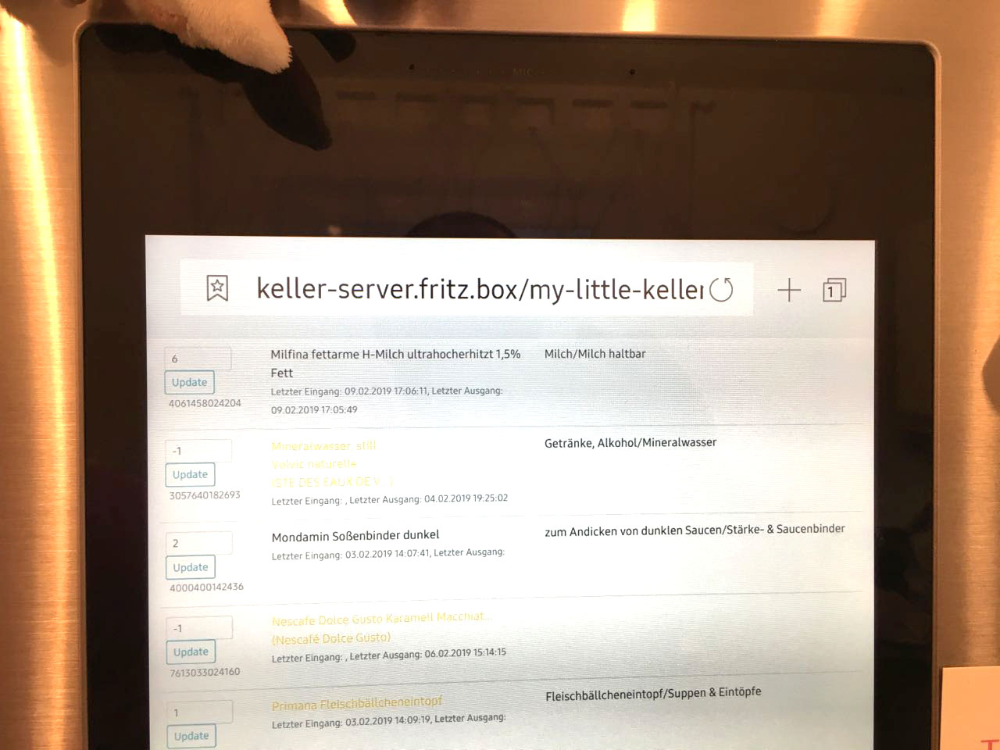

# My Little Keller

Application to track inventory using an event-driven model using Redis. Built with Spring Boot, Spring Data and Python. This is a playground project to demonstrate an integration between a Java-server side application and an Raspberry PI/IoT device.

**Frontend on the Fridge's Browser**



**Raspberry with LED Matrix Display**


Barcode scanner: [MetroLogic 1690 USB Barcode Scanner](https://country.honeywellaidc.com/CatalogDocuments/00-02098%20REV%20G.pdf)

## Building from Source

This app can be easily built with the maven wrapper. You also need JDK 1.8.

```bash
$ ./mvnw clean install
```

## Launching the Server

This app can be easily started with the maven wrapper.

```bash
$ ./mvnw spring-boot:run
```

## Launching the CLI

Requires Python 2.7 with requests and PIL dependencies.

```bash
$ cd cli
$ python cli.py localhost:8080
```

## Modules

* `my-little-keller`: Spring Boot app. Requires Redis to store events and the read cache.
* `cli`: Python app to read EAN code a from stdin and report these to `my-little-keller` endpoints. The python app is intended to run on a RaspberryPI with an [8x8 LED matrix with I2C attached](https://www.adafruit.com/product/870) to display CLI feedback. 

## API

The server app exposes a HTTP API to submit inbound, outbound, and inventory events:

* Incoming item: api/events/inbound accepting JSON such as `{"ean":"…", "count": …}`.
* Outgoing item: api/events/outbound accepting JSON such as `{"ean":"…", "count": …}`.
* Update inventory count: api/events/inventory accepting JSON such as `{"ean":"…", "count": …}`.

License
-------
This is Open Source software released under the
[Apache 2.0 license](http://www.apache.org/licenses/LICENSE-2.0.html).

Contains imported Python code from https://github.com/Adafruit.

